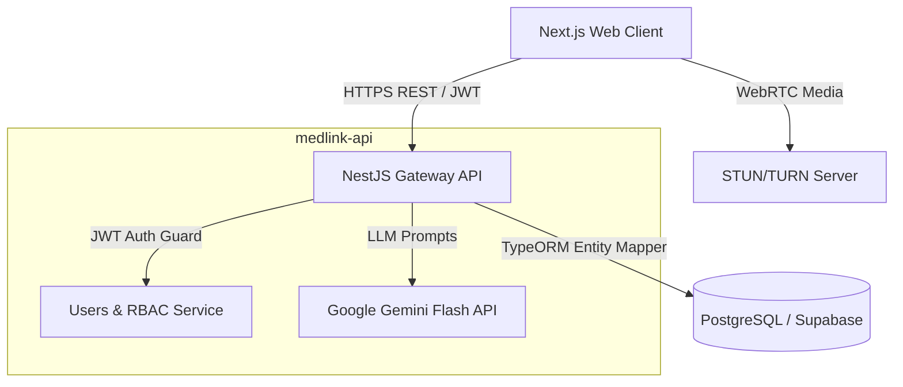
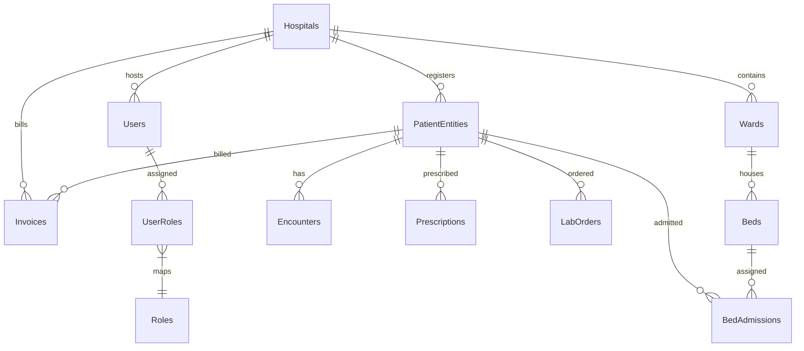

# 🏥 MedLink Addis — Next-Gen EMR & Hospital Management System

[](https://nextjs.org/)
[](https://nestjs.com/)
[](https://tailwindcss.com/)
[](https://www.postgresql.org/)
[](https://deepmind.google/technologies/gemini/)

MedLink Addis is an enterprise-grade, multi-tenant Electronic Medical Record (EMR) and Hospital Management System (HMS) designed to streamline clinical workflows, automate documentation, and secure operations. It features ambient AI clinical scribes, WebRTC-based telehealth consultations, live ward maps, and strict HIPAA-compliant audit logs.

---

## 🗺️ System Architecture & Folder Layout

```
Med link addis/
├── medlink-addis/           # Next.js Frontend Client (Zustand, Tailwind, Lucide)
├── medlink-api/             # NestJS Backend REST API (TypeORM, Supabase, JWT)
├── Assets/                  # Mock screenshots & volumetric interface design guides
├── Spec.md                  # Deep clinical workflows specification
├── SYSTEM_AUDIT.md          # HIPAA compliance framework guidelines
└── .gitignore               # Multi-project exclusions (ignores .env and node_modules)
```

---

## 🏗️ Technical Stack & Data Flow



---

## 📦 Database Schema Diagram (TypeORM Entities)

MedLink Addis uses TypeORM to map database tables dynamically. The database leverages **UUIDs** for resource identification and strictly isolates resources via a `hospital_id` tenant key for complete multi-tenant security.



---

## 🔌 API Routes Reference Matrix

All endpoints require a `Bearer <JWT_TOKEN>` authorization header except public authentication routes.

### 🔑 Authentication & Admin Module
| Method | Endpoint | Description | Access Level |
| :--- | :--- | :--- | :--- |
| `POST` | `/auth/login` | Log in and retrieve JWT session token | Public |
| `POST` | `/users` | Create a new staff account | Hospital Admin |
| `GET` | `/users` | Retrieve all registered staff members | Hospital Admin |

### 📋 Patient Demographics & Records Module
| Method | Endpoint | Description | Access Level |
| :--- | :--- | :--- | :--- |
| `GET` | `/patients` | List patients with pagination & query search | All Staff |
| `POST` | `/patients` | Register new patient & generate MRN | Admin, Nurse, Triage |
| `GET` | `/patients/:id` | Get patient details & complete history logs | All Staff |

### 🛏️ Inpatient Ward & Bed Manager
| Method | Endpoint | Description | Access Level |
| :--- | :--- | :--- | :--- |
| `GET` | `/beds/wards` | Get ward map & bed occupancy details | Admin, Doctor, Nurse |
| `GET` | `/beds/admissions` | Get all active bed admissions | Admin, Doctor, Nurse |
| `POST` | `/beds/assign` | Assign a patient to an unoccupied clean bed | Receptionist, Admin |
| `POST` | `/beds/admissions/:id/release` | Discharge patient and release bed | Receptionist, Admin |

### 💊 Pharmacy inventory & Dispensing
| Method | Endpoint | Description | Access Level |
| :--- | :--- | :--- | :--- |
| `GET` | `/pharmacy/prescriptions` | Retrieve all pending & completed prescriptions | Pharmacist |
| `GET` | `/pharmacy/inventory` | Retrieve stock levels & critical inventory levels | Pharmacist |
| `POST` | `/pharmacy/dispense/:id` | Deduct stock and dispense prescription | Pharmacist |

### 🧪 Laboratory Orders & Scans
| Method | Endpoint | Description | Access Level |
| :--- | :--- | :--- | :--- |
| `GET` | `/laboratory/orders` | Retrieve pending & resulted lab orders | Lab Tech, Doctor |
| `POST` | `/laboratory/orders` | Place new laboratory order request | Doctor |
| `POST` | `/laboratory/orders/:id/result` | Save test results & toggle critical alerts | Lab Tech |

---

## ⚡ Highlighted Features & Workspace Layouts

### 🎥 1. Real-Time Telehealth Split-Screen
- **Action**: Accessible via **"Start Telehealth"** on any active patient's chart context banner.
- **Split Layout**:
  - **Left Screen**: Live WebRTC call console displaying active call timer, remote patient webcam mockup, local video preview camera, audio mute controls, and red call disconnect button.
  - **Right Screen**: Real-time SOAP clinical workspace, allowing physicians to type notes immediately during a consultation.

### 🧬 2. Automated Vitals Synchronization
- **Action**: Accessible via **"Import Triage Vitals"** button located on the **Objective (O)** note card in the doctor workspace.
- **Data Flow**: Connects directly to the patient's triage queue records. Automatically fetches, formats, and appends blood pressure, heart rate, oxygen levels, and temperature metrics to the physician notes.

### 🛡️ 3. HIPAA Security Compliance Logs
- **Action**: Accessible via `/settings` -> **Security Audit Logs** tab (Hospital Admins only).
- **Log Metrics**: Captures and details timestamps, action categories, access levels (staff name + role), exact details, and client IP addresses for all system logins, chart reads, and prescription dispensing.
- **Searchable**: Real-time filtering by actor name, action category, or description.

### 📁 4. Lab Attachments & Scan Upload Desk
- **Action**: Accessible via `/laboratory` -> **Enter Results** modal.
- **Upload Zone**: Includes a drag-and-drop zone with animated progress indicators, supporting PDFs, Chest X-rays, Ultrasounds, and MRI scans.

---

## 🚀 Quick Launch & Build Commands

### 📂 medlink-api (NestJS Server)
```bash
cd medlink-api
# Install dependencies
npm install

# Initialize PostgreSQL database schema and seed mock users, roles, wards, and beds
npm run seed

# Run the backend in development hot-reload mode
npm run start:dev
```

### 💻 medlink-addis (Next.js App Client)
```bash
cd medlink-addis
# Install dependencies
npm install

# Compile TypeScript and build optimal production bundles
npm run build

# Start NextJS local server
npm run dev
```
Open **[http://localhost:3000](http://localhost:3000)** in your browser.
